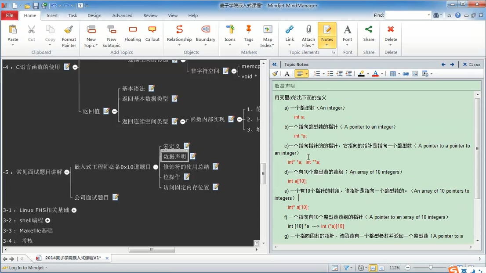
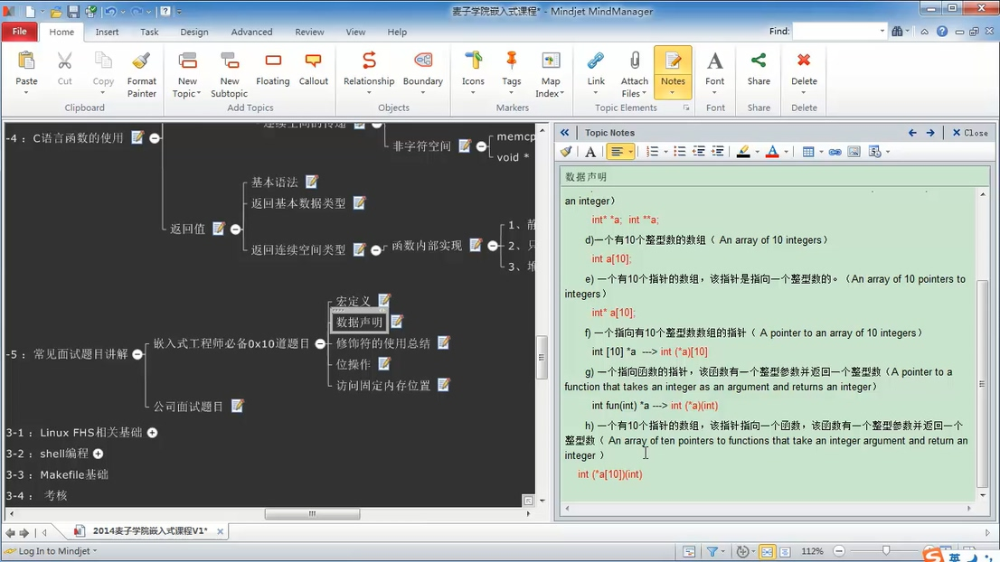

###                                                                                   与JAVA的不同之点

在C中，数组变量名不是代表了数组变量的所有数据值，而只是代表着该数组值的首地址值，也是数组指针为0的数据的地址值


C中的for（）语句的第一个参数变量的声明需要在（）之前。

如：int i;

​      for(i=0;i<10;i++){

​      }


运算符！与~的区别：！是进行数学逻辑的取反（即1→-1），~是进行逐位取反（即0x0000 00ff→0xffff ff00）。

###                                                                                            C环境的搭建

    类似于java环境的搭建，java搭建的话首先需要搭建jdk编译环境和开发环境。同样C语言也是，C的编译环境有很多种，有微软自带的Microsoft software C++ ，还有一种Linux上的GNU组织的GCC,
在Window平台上的叫MinGW。如果用微软的话，需要和微软开发的IDE编辑环境工具配合使用，但如果使用MinGW的话就可以自己搭建一个编辑环境，选择自己喜欢的IDE,如Clion。
    有了编译环境后同样也要配置环境变量。
    在选择一个好的IDE编辑环境，如Clion


###                                                                                                           GCC的概述

GCC最初的全名是GNU C Compailer，即是GNU公司的C语言的编译器

GNU公司是嵌入式开发领域的领军者，一个开源的组织，很多嵌入式开发都与这个组织相关

随着GCC支持的语言越来越多，它的名称变成了GNU Comlier Collection（GCC）：翻译组织


###                                                 编译的过程

   C程序文件是以“.c”为后缀名，编译过程首先会将C程序编译成汇编文件，汇编文件是以“.s”为后缀名，接着进行汇编，即将汇编文件转换成二进制文件，也就是最后能够识别的文件，后缀名为“.o”。
最后进行链接，将C程序所需的指令进行汇总，比如关联指令库。

编译过程：1.编译,2.汇编,3.链接
文件转变过程：.C  .S  .O

  其实在编译的过程中，编译的上一步还有一个步骤，就是预处理。什么叫预处理：即使在编译之前对程序进行预先定义，等到编译时才进行判断，如语法上的判断。
预处理的定义主要以#加关键词。有#include和#defind。即引入头文件和预定义宏，和条件预处理

  所以实际编译过程为 :1.预处理 2.编译,3.汇编,4.链接


###                                           预处理中宏的使用

   编译环境本身已经为我们提供了一些预处理的宏。如__FUNCTION__,__LINE__,__FILE__.....。如果在代码中加入了这三个预定义宏的话会有什么效果呢？
__FUNCTION__:会在程序执行后打印出该预定义宏所处的方法
__LINE__：会在程序执行后打印出该预定义宏所在的行数
__FILE__：会在程序执行后打印出该预定义宏所在的文件名

  除了使用编译环境准备的宏。我们还能自定义预定义宏。
定义步骤：#defind 宏名 宏体 。如#defind A 1+2。注意在编译期的时候程序如果引入了宏之后，在某些算数情况下会出现算数优先级，可能会导致程序结果与预料结果不一致。这就可能是优先级导致的。
那么最好在定义宏的时候在宏体外加个（）。#defind A （1+2）


###                                      C中的true|false值是什么？

不为0即为真


###                                                  类型修饰符

 在讲类型修饰符之前了解下程序的执行流程，首先程序以二进制的数据写入存储器（内存），CPU按顺序执行程序逻辑，但CPU不是直接读取存储器内的数据，而是读取寄存器内的数据，所以存储器内的数据先会放到寄存器内在在被CPU执行。
  寄存器是在CPU附近零散的硬件，也是存放数据的空间，它的数据读取速度最快，也是CPU直接联系的空间。
  数据读取速度慢到快：硬盘，内存，寄存器。
  那么类型修饰符的意义就是修饰声明该数据是指定到哪个区域。一般不写的话默认是auto。也就是可读可写的内存。register知名存放的位置在寄存器。

_register.JPG)


###                                               进制的转换

####十进制转二进制

那十进制的数是怎样转化成二进制的数呢？有一个最简单的方法，就是不断除以2。余数写在右边。然后从最后一个得到的商倒回去（商余数排列起来），得到的数就是二进制要表达的结果了哦。举几个例子，如图。


####二进制转十进制

接下来学习把二进制的数转化为十进制的数。从左边第一位数乘以2的n-1次方（幂），n代表该数字从右到左数起的位数。加上从左边第二位数乘以2的n-2次方。依此类推，一直到最后一个数。看图认真学习。图中^的符号就是表示次方（幂）的意思，在打不出的情况下，可以这样表示的哦。


####                                                            贴士：


###                               指针变量的大小和指针读取的方法

​     首先在32位系统中指针变量的大小为4个字节32个bit，那是为什么呢？

​     因为在32位系统中，支持的最大内存为4G（2^32个字节），每个字节有一个内存地址，那么声明的指针变量的

最大容纳大小必须能够容纳4G内存最大的内存地址，也就是2^32，那么刚好有一个就4个字节（32位）。所以在32位系统一个指针变量的大小为4字节。

​    

###                                             指针修饰符const

const修饰符的意义是使修饰的内存具有常量性，也就是只读不可写。

那么把它与指针结合在一起具有什么形式呢？

#### 无修饰声明的指针

char * p

#### 用const修饰的指针

1 const char * p

   char const * p

2  char * const  p

   char * p const

一和二内的两种写法的意义是一样的，但一和二之间又有何区别呢？

1：正常情况下修饰的意义是内存上的值是具有常量性，不可改变，也就是改地址上的内容不能改变

2：正常情况下修饰的意义是指针变量是具有常量性，不可改变，也就是指针所指向的地址不能改变


###                                          指针变量的加减运算

代码：

```
int a = 0x12345678;
int b = 0x87654321;

int *p_b1=&b;
p_b1++;
char *p_b2=(char * )&b;
printf("this p1 + 1 is %x,%x,%x\n",*(p_b1+1),p_b1[1],*p_b1+1);
printf("this p2 +1 is %x\n",p_b2[1]);
```

运算符：++，--，+，-

指针变量p_b1+1并不是直观上看着内存地址值加1，加的值取之于该指针变量的属性，是int还是char或者其他

加一实际上就是根据该指针变量的属性，如果是int类型指针变量，那么它+1后，它的内存地址值跳跃了4个字节。

如果是char类型指针变量，它则跳跃了1个字节。

####                                                         ++与+的区别

++会改变该指针变量原有的值，+则不会。同理--和-

####                                                        p[1]和*（p+1）

同样都是取该指针变量+1后上的值，

####                                             用指针变量运算符改变const常量

代码：

const int a=0x12345678;

int b=0x87654321;

int *p_b=&b;

p_b[1]=100;

printf("a=%x\n",a);


##                                    数组与指针的区别

数组char buf[10]="abc" 与 指针char * p_buf="abc"

”abc“的意义是一个字符串常量abc。

char buf[10]="abc"的意义是拷贝一个字符串常量abc到buf内。

char * p_buf=”abc“的意义是把字符串常量的abc的内存地址赋值给p_buf。

####                                              那么在操作时有什么区别

由于是abc的常量字符串，那么它在一定情况下具有只读性，所以如果指针变量p_buf直接操作该值的话就会造成断错误。而buf是一个数组，在拷贝之后它与“abc”没有关系了，所以它可以直接操作buf值


###                                               内存分布

   不同数据会存在不同系统内存地址内，有的系统内存地址下的数据只读（R），有的可读可写（RW）。

地址总线从小到大 0X0→0xffffff可划分为：

代码段（程序代码数据存在内存地址段）     R

只读数据段（“Hello World”的字符串常量） R 

全局的数据空间（初始化的，未初始化的）  RW

----------------------------------------------------------

运行时的堆空间

--------------

栈空间（局部变量）                                         RW

-----------

内核空间  应用程序不可访问

##### 备注

1.在C语言里，用const修饰的变量存在栈空间地址段，由于改地址段的数据是可读可写的，故导致名义上的常量并不是常量。

2.由于程序在运行时，程序代码数据会占用内存（存在代码段），所以一些不必要的代码在发行的时候尽量删除。


###                                         指针与数组的关系

代码：

```
int array[5]={1,2,3,4,5};
int * p_array=array;
printf("p_array=%#x\n",p_array);
printf("p_array[0]=%#x\n",p_array);
printf("p_array[1]=%#x\n",p_array+1);
printf("p_array[2]=%#x\n",p_array+2);
printf("p_array[3]=%#x\n",p_array+3);
printf("p_array[4]=%#x\n",p_array+4);
```

结果：

p_array=0x61ff18
p_array[0]=0x61ff18
p_array[1]=0x61ff1c
p_array[2]=0x61ff20
p_array[3]=0x61ff24
p_array[4]=0x61ff28

##### 1.数组变量名值是该数组首元素的地址值

##### 2.指针变量值++，其结果根据指针属性的字节数，在基础上加上该 指针属性的字节数

如：char * p=0x000000;

​       p++;

​       printf("p=%#x=",p)

输出：p=0x000001

​      int* p=0x000000;

​       p++;

​       printf("p=%#x=",p)

输出：p=0x00004


###                                             字符串的定义

上面提到数组变量名即是数组的首元素的地址。

即：char []array="Hello Wrold";

​       char *p=array;

​      由于array=“Hello Wrold”，

​      那么 char *p=“Hello Wrold”

最终字符串的定义为：

char *p=“Hello Wrold”     


###                                         不同数据类型之间的运算

```
通常数据之间的转换遵循的原则是“类型提升”，即如果一个运算符有两个不同类型的操作数据，那么在进行运算之前，先将较低类型的数据提升为较高类型，从而使两者的类型一致(但数值不变)，然后在进行运算，其结果是较高类型的数据。类型的高低是根据其数据所占用的空间大小来判定的，占用空间越多，类型越高；反之越低。
```

​       


###                                                        数据声明

 

 


###                                                      位运算

​        在C中最小的操作单位是bit，即一个字节有8个bit俗称有8位。那么在与硬件大招到时，经常会遇到与位操作的时候。

#### 操作符：<< ,>>

作用：左右移位

左右移位的具有的性质：

1.<<:  整体向左移位，低位数补零；

2.>>：整体向右移位，但与左移另外注意的是，由于在C中的第一位是判别正负数的。那么在进行右移后的空位是补什么好。那就要取决于该数是正数还是负数了，正数高位补0，负数高位补1；

表达式：int a=5；

​               a=a<<1;

​               printf("a=%d";a);

解释：int a的二进制数是0101，<<表示进行向左移位。低位补0。二进制结果为：01010

输出：10；

为何输出10：左移一位即×2，左移二位即×4。相同，右移即除

公式：左移：a=a×2^n

​            右移：a=a÷2^n

在C语言中涉及到乘法运算，比如5*5，在底层的原理上就是根据位移运算实现乘法的

#### 操作符：&（异） ；|（或）

异或具有的性质：

> &表示设置（set），即设置某位上为1，其他为不变。
>
> |表示清楚(clear)   ，即清除某位上为0，其他为不变。

实例：如一字节（8bit）;

​           int a = 0000 1010;

​           现在把第3bitset为1（高位）。（注意：高位为1，低位为0）

​           a=a|(0x1<<3)

0x1<<3:结果位1000，最后3bit置为1，其它位不变。


​           现在把第3bitset为0（低位，）

​            a=a&~(0x1<<3)

~0x1<<3:显示左移3位，低位补0→1000，在进行取反→0111。最后3bit清除位0，其它位不变。


 